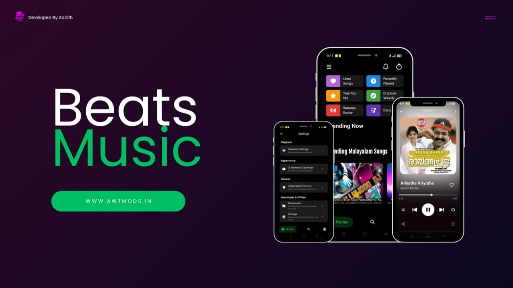
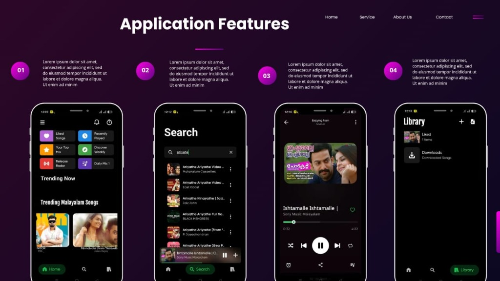

**<h1 align=center>Beats Music 🎵</h1>**

 
   

Beats Music is an experimental open-source music player designed to bring you ad-free tunes from various sources. Dive into a world of limitless music from platforms like YouTube and JioSaavn,Spotify, with more sources blooming soon! 🎵

### **Why Beats Music?**

🌟 **Ad-Free Experience:** Say goodbye to interruptions and enjoy uninterrupted musical bliss.

🌍 **Multi-Source Player:** Access your favorite tracks from diverse platforms, with more sources continually joining our melody garden.

🚀 **Flutter-Powered:** Built with Flutter and BLoC architecture for beautiful design and smooth functionality.

### **Features**
- [x] 🚫 Ad-Free Music
- [x] 📝 Lyrics Support (Time Synced)
- [x] 📊 Scrobble music with Last.FM
- [x] 🎵 Offline Music Experience
- [x] 🔽 Import playlists from various sources
- [x] ⏲️ Sleep Timer
- [x] 🎧 Personalized Playlist Creation and Sharing
- [x] 🌐 Daily Updated Global Charts (Billboard, Last.fm and more)
- [x] 🖥️ Support for Android
- [x] 📉 Minimal Data Usage
- [x] 💾 Space Efficient
- [x] 🏃 Lightweight App
- [x] 🔓 Open Source
- [x] 💿 Play Automatic Related Songs
- [x] 🎸 Share your playlists with others
- [x] 🆎 Multi-Language support
- [ ] 🎼 AI-Generated Playlist
- [ ] 💡 AI-Based Recommendations

<h3 align=center>Download for Android 😍</h3>

 

<h3 align="center"> Support Development</h3>

If you enjoy using Beats Music, consider supporting the development!

### **Contribute to Beats Music! 🎶**

🌱 **Every Note Counts:** Your contribution, no matter how small, adds to the richness of Beats Music. Whether you're fixing a bug, enhancing features, or suggesting improvements, your notes in our melody matter.

🚀 **Learn and Grow:** Contribute to Beats Music and enhance your Flutter and BLoC skills. Every pull request is an opportunity to learn, and we encourage contributors of all levels to join the journey.

To ensure a smooth and collaborative contribution process, we kindly ask that you first open an issue to discuss your ideas or proposed changes. This helps us align on the best approach and makes the review process more efficient. For detailed guidelines, please refer to our [CONTRIBUTING.md](CONTRIBUTING.md).

**How to Contribute:**

1. **Fork the Repository:** Start your Beats Music journey by forking **main(Branch)**.

2. **Clone Locally:** Clone the forked repository to your local machine.

3. **Create a Branch:** Create a new branch for your contribution.

4. **Make Changes:** Make your contribution - fix a bug, add a feature, or improve the documentation.

5. **Push Changes:** Push your changes to your forked repository.

6. **Create a Pull Request:** Submit a pull request, and let your notes join the Beats Music Symphony!

 

<h4 align=center>Developed by Aadith C V</h4>

