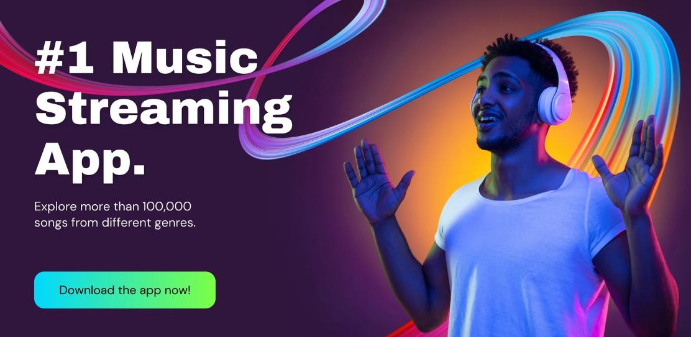

# Beats Music

**A unified local and plugin-first streaming music player built with Flutter & Rust.**

  
  
  
  
   
   
  
   
   
  
  
  

**Beats** is a modern, open-source music player designed to give you absolute freedom over your audio. Seamlessly mix your **local device music** with an infinite universe of streams powered by a secure, **Rust-backed plugin system**. No ads, no interruptions—just your tunes, your way. 🌼🎵

---

## 🚀 Features

### 🎵 Core Audio & Playback

- [x] 🚫 **Ad-Free Experience:** Zero interruptions, just pure music everywhere.
- [x] 🦀 **Rust-Powered Plugins:** Secure, auto-updating `.bex` system for infinite global music sources.
- [x] 📂 **Hybrid Library:** Seamlessly mix local offline music and online streams in a single queue.
- [x] 📶 **Offline Mode:** Download system to save your favorite streams and playlists for offline playback.
- [x] 🎛️ **Audio Perfection:** Built-in Equalizer, customizable Crossfade transitions, gapless playback, and pitch/speed adjustments powered by `media_kit`.

### 🎤 Engagement & Discovery

- [x] 🎙️ **Karaoke-Style Lyrics:** Dynamic, time-synced lyrics with manual offset adjustment.
- [x] 📈 **Global Charts & Moods:** Top songs, top artists, and curated mixes customized to you.
- [x] 🔄 **Smart Recovery Engine:** Automatically cross-checks and replaces dead streams with working alternatives dynamically.
- [x] 🎧 **Advanced Queue Management:** Up-next lists, related song autoplay, and drag-and-drop reordering.

### 🎨 Customization & Interface

- [x] 🌍 **12+ Languages:** Fully localized interface encompassing 12+ international languages.
- [x] 💅 **Dynamic UI & Palettes:** UI natively adapts and extracts a vibrant color palette derived from album artwork.
- [x] 🖥️ **Cross-Platform & Responsive:** Fluid Native media controls and adaptive UI constraints tailored specifically for Windows, Linux, and Android variants.
- [x] ⌨️ **Keyboard Shortcuts:** Full keyboard hotkey support for power users.
- [x] ⏱️ **Sleep Timer:** Automatic playback shutoff.

### 🔌 Integrations & Sync

- [x] ☁️ **Cloud Connectivity:** Effortlessly backup, sync, and restore your Playlists, Liked Songs, Downloads, and Statistics to the cloud.
- [x] 📊 **Last.fm Scrobbling:** Detailed tracking of listening history (includes fallback caching for offline mode).
- [x] 🎮 **Discord Rich Presence:** Show off your current tunes dynamically on your Discord profile using native RPC integrations.
- [x] 💾 **Library Portability:** Directly import/export M3U, JSON playback data, and settings.

---

## 🌍 Language Support

| Language | Native Name | Status |
|----------|------------|--------|
| 🇺🇸 English | English | ✅ Complete |
| 🇮🇳 Hindi | हिन्दी | ✅ Complete |
| 🇪🇸 Spanish | Español | ✅ Complete |
| 🇫🇷 French | Français | ✅ Complete |
| 🇧🇳 Bengali | বাংলা | ✅ Complete |
| 🇷🇺 Russian | Русский | ✅ Complete |
| 🇸🇦 Arabic | العربية | ✅ Complete |
| 🇵🇹 Portuguese | Português | ✅ Complete |
| 🇰🇷 Korean | 한국어 | ✅ Complete |
| 🇩🇪 German | Deutsch | ✅ Complete |
| 🇯🇵 Japanese | 日本語 | ✅ Complete |

---

## 📥 Download & Install

  
  &nbsp;
  

---

## 💖 Support the Development

Beats is a passion project built by **Aadith C V**. If you love the app and want to keep it ad-free and evolving, consider a small contribution! Every bit helps keep the music playing. ☕🎶

### 💰 Donation Options

| Method | Details |
|--------|---------|
| **UPI (India)** | `aadithaadith14-2@okaxis` |
| **PayPal** | [paypal.me/DevAadith](https://paypal.me/DevAadith) |
| **Bitcoin (BTC)** | `15w6uDZ7aMAo9CqMBBNX8YkNH3qGEJzuDX` |
| **ETH / USDT (TRC20)** | `TBgX4jo8byy2pjfUvWTiEbcUVbybBm7Q85` |

---

## 🤝 Contribute

**Every note counts!** Whether you're a seasoned developer or just starting, your pull requests and bug reports are highly appreciated.

1. **Discuss:** Open an Issue to share your ideas.
2. **Fork & Clone:** Fork the `main` branch.
3. **PR:** Submit a pull request and join the symphony!

*Read our [CONTRIBUTING.md](CONTRIBUTING.md) for full guidelines.*

---

## 📫 Get in Touch

<i>Developed with ❤️ by Aadith C V</i>

<i>Made with ❤️ in India</i>

